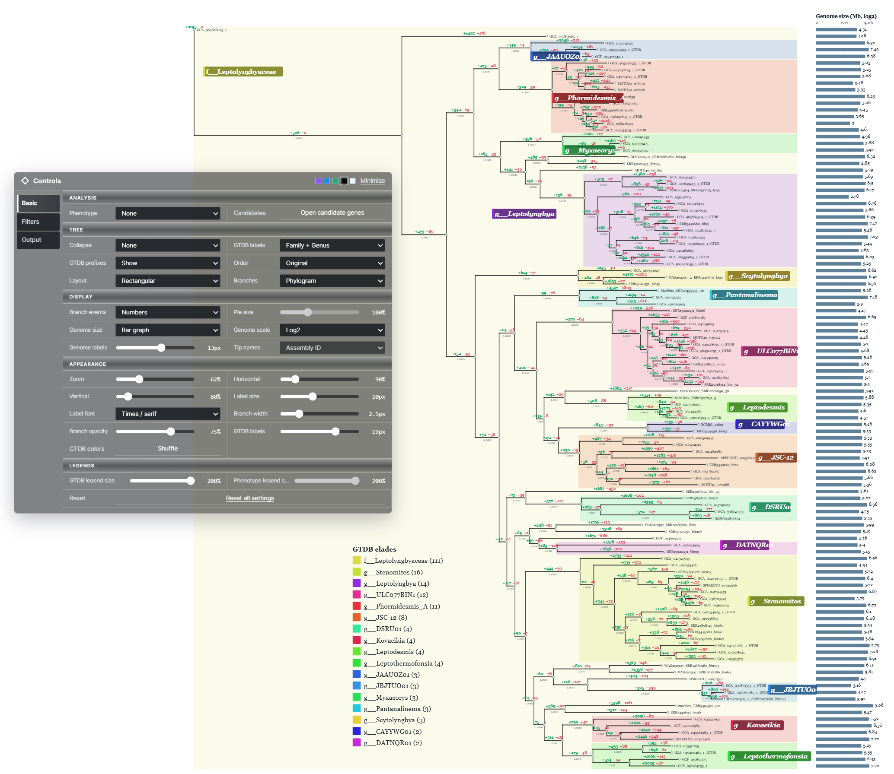
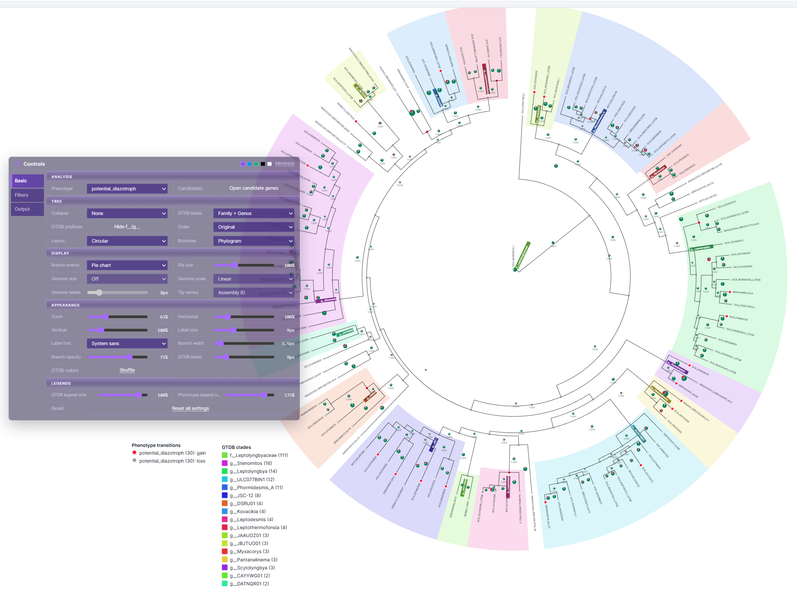

# PhyloGain

PhyloGain is a visualization tool that uses **OrthoFinder or PIRATE results to infer and display gene family gains and losses across a phylogenetic tree**. It counts gain and loss events along each branch, making it easy to identify lineages with major changes in gene content. Users can also inspect the gene families associated with each gain or loss event and view their member gene IDs.

Example visualizations in rectangular and circular layouts:





## Install

### Create a mamba environment and install with pip

```bash
mamba create -n phylogain -c conda-forge python=3.11 pip -y
mamba activate phylogain
pip install git+https://github.com/kazumaxneo/PhyloGain.git
```

### Create the environment from YAML

The repository includes `environment.yml`, which creates the environment and installs PhyloGain from the cloned source.

```bash
git clone https://github.com/kazumaxneo/PhyloGain.git
cd PhyloGain
mamba env create -f environment.yml
mamba activate phylogain
```

## Quick start

PhyloGain accepts either OrthoFinder or PIRATE output. The two standard workflows are:

- **OrthoFinder -> eggNOG-mapper -> GTDB-Tk -> PhyloGain**
- **PIRATE -> eggNOG-mapper -> GTDB-Tk -> PhyloGain**

### Step1a. Run OrthoFinder

Place the protein FASTA files in one directory and run OrthoFinder.

```bash
orthofinder -f proteomes -t 16 -a 16
```

The directory created under `proteomes/OrthoFinder/` is used as the PhyloGain input.

Alternatively,

### Step1b. Run PIRATE instead of OrthoFinder

Place one GFF3 file per genome in a directory and run PIRATE.

```bash
PIRATE -i gff_files -o pirate_output -t 16
```

The `pirate_output/` directory is used as the PhyloGain input. It must contain `PIRATE.gene_families.tsv`; PhyloGain can also use `binary_presence_absence.nwk` and `representative_sequences.faa` from this directory.

### Step2. Run eggNOG-mapper

The official eggNOG-mapper database download script may currently fail. Download the prebuilt [eggNOG-mapper database snapshot](https://zenodo.org/records/18780433) described in [this installation note](https://kazumaxneo.hatenablog.com/entry/2020/02/08/225420), extract it, and set `EGGNOG_DATA_DIR` before running `emapper.py`. The archive is a static, unmodified eggNOG DB v5.0.2 snapshot for eggNOG-mapper v2.1.x (approximately 12 GB to download).

```bash
curl -L -C - "https://zenodo.org/records/18780433/files/eggNOG_DB_v2.zip?download=1" -o eggNOG_DB_v2.zip
unzip eggNOG_DB_v2.zip
export EGGNOG_DATA_DIR="$PWD/eggNOG_DB_v2"
```

#### OrthoFinder workflow

Combine the same protein FASTA files used by OrthoFinder, then annotate them with eggNOG-mapper. Gene IDs must remain identical to those in the OrthoFinder results.

```bash
cat proteomes/*.faa > all_proteins.faa
emapper.py -i all_proteins.faa --itype proteins --output eggnog --cpu 16 --data_dir "$EGGNOG_DATA_DIR"
curl -L https://purl.obolibrary.org/obo/go/go-basic.obo -o go-basic.obo
```

#### PIRATE workflow

Annotate the representative protein sequences produced by PIRATE.

```bash
emapper.py -i pirate_output/representative_sequences.faa --itype proteins --output pirate --cpu 16 --data_dir "$EGGNOG_DATA_DIR"
curl -L https://purl.obolibrary.org/obo/go/go-basic.obo -o go-basic.obo
```

### Step3. Run GTDB-Tk

Run GTDB-Tk on the corresponding genome assemblies.

```bash
gtdbtk classify_wf --genome_dir genomes --out_dir gtdbtk_output --extension fna --cpus 16
```

For bacterial genomes, use `gtdbtk_output/gtdbtk.bac120.summary.tsv` in the next step.

### Step4. Run PhyloGain

#### OrthoFinder input

```bash
phylogain build --orthofinder proteomes/OrthoFinder/Results_MmmDD --annotations eggnog.emapper.annotations --gtdb-taxonomy gtdbtk_output/gtdbtk.bac120.summary.tsv --go-obo go-basic.obo --fetch-kegg-names --output phylogain_output
phylogain serve phylogain_output
```

Replace `Results_MmmDD` with the actual OrthoFinder result directory.

#### PIRATE input

```bash
phylogain build --pirate pirate_output --annotations pirate.emapper.annotations --gtdb-taxonomy gtdbtk_output/gtdbtk.bac120.summary.tsv --go-obo go-basic.obo --fetch-kegg-names --output phylogain_output
phylogain serve phylogain_output
```

For PIRATE, a rooted species tree can be supplied with `--species-tree rooted_species_tree.nwk`. Without it, PhyloGain uses `binary_presence_absence.nwk` from the PIRATE output directory. The viewer opens in a web browser after `phylogain serve` is run.

## Add phenotype metadata

Phenotypes can be supplied as a tab-separated file. The first column must be `species_id`, and its values must match the tip names in the phylogenetic tree.

```text
species_id	nitrogen_fixation	heterocyst
species_A	+	+
species_B	+	-
species_C	-	-
species_D	?	?
```

Accepted states are `+`, `-`, `?`, `1`, `0`, `present`, `absent`, and `unknown`.

Add `--phenotypes` to either PhyloGain command. Use `--phenotype` to select a column; omit it to analyze every phenotype column.

OrthoFinder input:

```bash
phylogain build --orthofinder proteomes/OrthoFinder/Results_MmmDD --annotations eggnog.emapper.annotations --gtdb-taxonomy gtdbtk_output/gtdbtk.bac120.summary.tsv --go-obo go-basic.obo --fetch-kegg-names --phenotypes phenotypes.tsv --phenotype nitrogen_fixation --output phylogain_output
phylogain serve phylogain_output
```

PIRATE input:

```bash
phylogain build --pirate pirate_output --annotations pirate.emapper.annotations --gtdb-taxonomy gtdbtk_output/gtdbtk.bac120.summary.tsv --go-obo go-basic.obo --fetch-kegg-names --phenotypes phenotypes.tsv --phenotype nitrogen_fixation --output phylogain_output
phylogain serve phylogain_output
```
